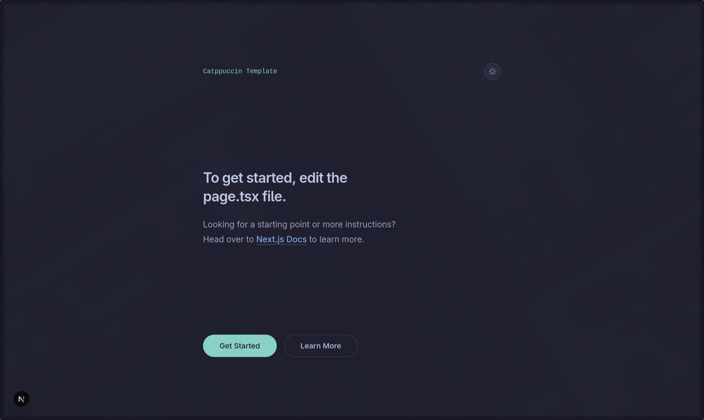

# Catppuccin Next.js Template

<div align="center">
  <p align="center">
    <strong>A beautifully themed Next.js template with Catppuccin palette.</strong>
  </p>
  <br />
  
</div>

&nbsp;

## 🖼️ Preview



## 🚀 Quick Start

You can use this template to jumpstart your next project using `bun create`:

```bash
bun create xshubhamg/catppuccin-next-template my-app
cd my-app
bun dev
```

> [!NOTE]
> Replace `xshubhamg/catppuccin-next-template` with the actual repository path if it's hosted elsewhere.

## ✨ Features

- **Catppuccin Palette**: Full integration of Catppuccin Latte (Light) and Mocha (Dark) themes.
- **Next.js 15+**: Leveraging the latest features of Next.js, including App Router and Server Components.
- **Tailwind CSS v4**: Modern, high-performance styling with zero-runtime CSS variables.
- **Auto Dark Mode**: Seamless theme switching using `next-themes`.
- **Phosphor Icons**: A flexible and consistent icon set.
- **TypeScript**: First-class support for type safety.
- **Style Guide**: Includes a detailed Catppuccin style guide for consistent design.

## 🛠️ Tech Stack

- **Framework**: [Next.js](https://nextjs.org/)
- **Styling**: [Tailwind CSS v4](https://tailwindcss.com/)
- **Icons**: [Phosphor Icons](https://phosphoricons.com/)
- **Theme Management**: [next-themes](https://github.com/pacocoursey/next-themes)
- **Runtime**: [Bun](https://bun.sh/)
- **Formatting & Linting**: Prettier & ESLint

## 🎨 Theme Usage

The template comes with semantic aliases mapped to the Catppuccin palette. You can use them directly in your Tailwind classes:

```tsx
<div className="bg-base text-text border-surface0">
  <h1 className="text-primary">Hello Catppuccin!</h1>
  <p className="text-subtext0">Soothing pastel theme for the high-spirited!</p>
</div>
```

Refer to `style-guide.md` for detailed instructions on how to use the palette effectively.

## 📁 Project Structure

- `src/app`: Next.js App Router routes and global styles.
- `src/components`: Reusable UI components (includes `ThemeProvider` and `ThemeToggle`).
- `src/lib`: Utility functions and shared logic.
- `style-guide.md`: Comprehensive guide for Catppuccin theme application.

## 📜 Scripts

- `bun dev`: Start development server.
- `bun build`: Build the application for production.
- `bun start`: Start the production server.
- `bun lint`: Run ESLint.
- `bun format`: Format code using Prettier.

## 📄 License

MIT
